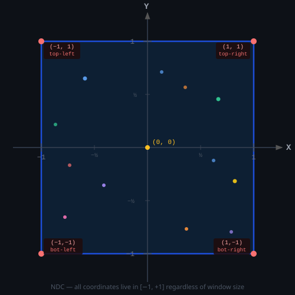
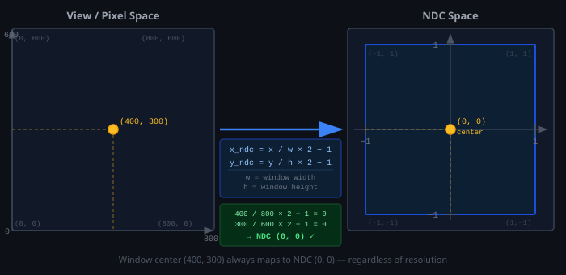
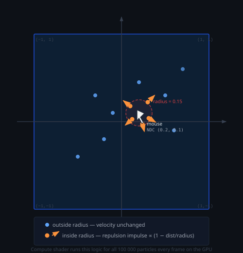

# Normalized Device Coordinates (NDC)

NDC is the coordinate system the GPU uses to represent positions on screen.
No matter how large or small the window is, the drawable area always maps to the
same fixed range: **−1 to +1 on every axis**.

---

## The NDC Grid



The screen is always a square in NDC space. All shader positions must land inside
`[−1, +1]` on both axes or the geometry is clipped (discarded by the GPU).

| Point       | NDC          | Screen position  |
|-------------|--------------|------------------|
| `(−1,  1)`  | top-left     | ↖ corner         |
| `( 1,  1)`  | top-right    | ↗ corner         |
| `(−1, −1)`  | bottom-left  | ↙ corner         |
| `( 1, −1)`  | bottom-right | ↘ corner         |
| `( 0,  0)`  | center       | middle of screen |

---

## Why NDC Exists

Your window can be 400×300 or 2560×1600. The GPU doesn't want to know about
pixels — it wants a **resolution-independent** space that shaders can reason
about uniformly. NDC provides exactly that.

The GPU converts NDC → pixels internally at the end of the pipeline (this step
is called the **viewport transform**), so you never hardcode a resolution in a
shader.

---

## The Conversion Formula



```
          pixel_x                    pixel_y
x_ndc = ─────────── × 2 − 1       y_ndc = ─────────── × 2 − 1
          width                             height
```

Examples for an 800 × 600 window:

| Pixel        | Calculation                | NDC       |
|--------------|----------------------------|-----------|
| `(0, 0)`     | `0/800×2−1`, `0/600×2−1`   | `(−1, −1)` |
| `(400, 300)` | `400/800×2−1`, `300/600×2−1` | `(0, 0)` |
| `(800, 600)` | `800/800×2−1`, `600/600×2−1` | `(1, 1)` |

In this project the conversion happens in `mousePosNDC()` in `main.zig`:

```zig
const x = @as(f32, @floatCast(view_pt.x / bounds.size.width  * 2.0 - 1.0));
const y = @as(f32, @floatCast(view_pt.y / bounds.size.height * 2.0 - 1.0));
```

---

## How NDC Is Used in This Project

### Particle positions

Every particle stores its position in NDC. The vertex shader passes it straight
through to the GPU output — no projection matrix needed:

```metal
out.position = float4(particles[id].position, 0.0, 1.0);
//                    ───────────────────────
//                    already in NDC [-1, 1]
```

### Mouse repulsion

The mouse cursor arrives as screen pixels. `mousePosNDC()` converts it into NDC
so it lives in the same space as the particles, making the distance check in the
compute shader a single `length()` call:



```metal
float2 delta = p.position - mouse.pos;   // both in NDC
float  dist  = length(delta);
if (dist < mouse.radius && dist > 0.0001) {
    float falloff = 1.0 - dist / mouse.radius;
    p.velocity += normalize(delta) * mouse.strength * falloff;
}
```

---

## The Z and W Components

Shader positions are `float4`, not `float2`:

```metal
float4(x, y, z, w)
```

| Component | Meaning in this project |
|-----------|-------------------------|
| `x, y`    | NDC position on screen  |
| `z`       | Depth — `0.0` here because particles are flat 2D |
| `w`       | Homogeneous divisor — always `1.0` for non-perspective rendering |

The GPU divides `(x, y, z)` by `w` before rasterization. With `w = 1.0` this
is a no-op, which is correct for 2D rendering without a perspective camera.

---

## Summary

```
  Real world         CPU (Zig)             GPU (Metal shader)
  ──────────         ─────────             ──────────────────
  Window pixels  →   NDC float2        →   clip position float4(x, y, 0, 1)
  (mouse, UI)        range [−1, +1]        rasterised to actual screen pixels
```

NDC is the shared language between CPU code and shaders. Once everything is in
`[−1, +1]`, distance checks, physics, and rendering all use the same scale with
no pixel-size constants anywhere in the code.
